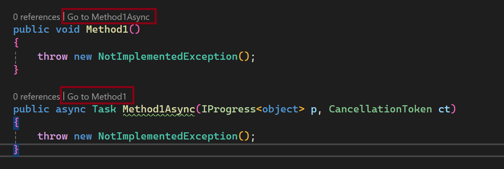

# SyncToAsyncExtension

A Visual Studio extension (VSIX) which creates codelenses allowed to goto to sync sibling method for async methods and vice-versa even if sibling method is in different file or code generated (for example, via [source generator](https://github.com/zompinc/sync-method-generator)).

